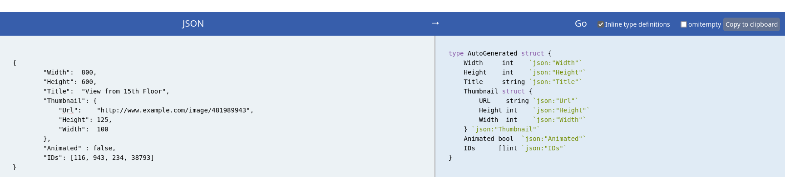

<!-- markdownlint-disable -->

# Unmarshal JSON to a GO data Structure

<a href="https://mholt.github.io/json-to-go/">JSON-to-Go</a><br>
It will give you the structure to be able to unmarshal the JSON.

<br>
<br>

<h1>JSON.stringify()</h1>

```javascript
var picture = {
  Width: 800,
  Height: 600,
  Title: "View from 15th Floor",
  Thumbnail: {
    Url: "http://www.example.com/image/481989943",
    Height: 125,
    Width: 100,
  },
  Animated: false,
  IDs: [116, 943, 234, 38793],
};
var transmit = JSON.stringify(picture);
document.write(transmit);
```

The `JSON.stringify()` method converts a JavaScript object or value to a JSON string, optionally replacing values if a replacer function is specified or optinally including only the specified properties if a replacer array is specified.<br>
<br>

<h1>Syntax</h1>

```javascript
JSON.stringify(value);
JSON.stringify(value, repplacer);
JSON.stringify(value, replacer, space);
```

<h2>Parameters</h2>

`value`<br>
The value to convert a JSON string<br>
<br>
`replacer`<br>
A function that alters the behavior of the stringification process, or an array of strings or numbers naming properties of `value` that should be included in the output. If `replacer` is **null** or not provided, all properties of the object are included in the resulting JSON string.<br>
<br>
`space`<br>
A `String` or `Number` object that's used to insert white space (including indentation, line break characters, etc.) into the output JSON string for readability purposes.

If this is a `Number`, it indicates the number of space characters to use as white space for indenting purposes; this number is capped at 10 (if it is greater, the value is just `10`). Values less than 1 indicate that no space should be used.

If this is a `String`, the string (or the first 10 characters of the string, if it's longer than that) is used as white space.

If this parameter is not provided (or is **null**), no white space is used.
<br>
<br>

<h3>Return Value</h3>

A JSON string representing the given value, or undefined.

<hr>
<a href="https://developer.mozilla.org/en-US/docs/Web/JavaScript/Reference/Global_Objects/JSON/stringify">READ MORE</a>
